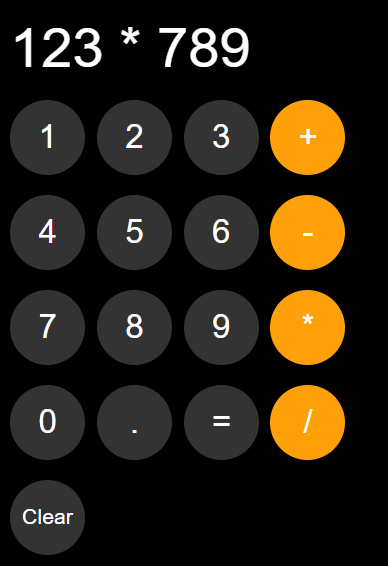

# 🧮 Calculator Web App

A simple and clean calculator built using **HTML, CSS, and JavaScript**.

## 🚀 Features

* Perform basic operations (+, −, ×, ÷)
* Clean UI design
* Real-time display updates
* Stores last calculation using localStorage

## 📸 Project Preview

## 🛠️ Tech Used

* HTML
* CSS
* JavaScript

## 📂 Project Structure

* `index.html` → Main structure 
* `style.css` → Styling 
* `script.js` → Logic 

## ⚡ How to Run

1. Download or clone the repo
2. Open `index.html` in your browser

## 💡 Future Improvements

* Add keyboard support
* Improve UI animations
* Add advanced operations

## 🙌 Author

Made by **Krishna**
